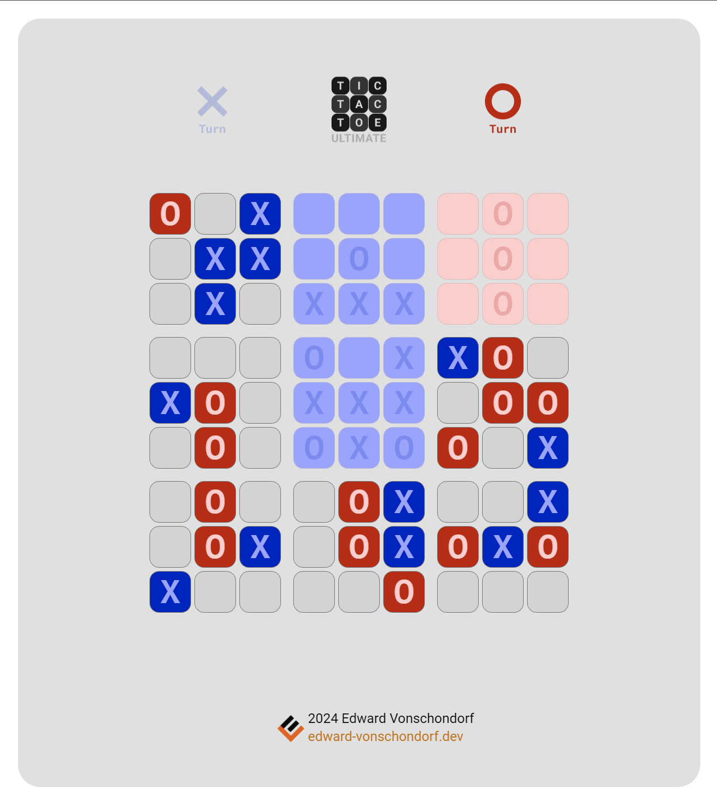

# Tic Tac Toe Ultimate
A JavaScript implementation of the ultimate version of the game Tic Tac Toe using the HTML5 canvas element.

## Play Now

[Tic Tac Toe Ultimate](https://tic-tac-toe-ultimate.pages.dev/)

- Alternatively you can clone the repository and use the Live Server extension in Visual Studio Code to run the game locally.

## Features
- Play Ultimate Tic Tac Toe on a 9x3x3 grid
- Play against a friend (locally)
- Playable with mouse or touch enabled devices.

### Notes

- This project originally started in my other repository [Tic-Tac-Toe](https://github.com/Torvec/tic-tac-toe) that I decided to split into two separate projects. The other is the Classic Tic Tac Toe game which can be found here: [Classic Tic Tac Toe](https://github.com/Torvec/tic-tac-toe-classic)